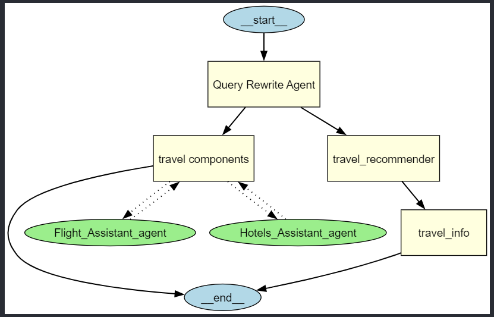

# travel_plan
Here are 20 user queries, with 5 simple ones and 15 complex ones.  

### **Simple Queries:**  
1. *Where can I go for a beach vacation?*  
2. *Book me a hotel in Paris.*  
3. *How much does a flight to Tokyo cost?*  
4. *What are some good places to visit in Italy?*  
5. *Find me a budget-friendly travel package for Europe.*  

### **Complex Queries:**  
6. *I’m looking for a honeymoon destination with a mix of adventure and relaxation. Preferably a tropical place with good resorts and some historical sites. Any recommendations?*  
7. *Can you help me plan a one-week trip to Japan, including flights, accommodation, and must-visit attractions? I’d like a mix of city life and traditional culture.*  
8. *I want to book a multi-city trip across Spain and Portugal. I need recommendations on the best way to travel between cities, good places to stay, and estimated costs.*  
9. *I have a business trip to New York next month. I need a hotel near the financial district, and my company will cover the cost up to $300 per night. Can you find options?*  
10. *We’re a family of four with young kids, looking for a vacation spot that has both kid-friendly activities and places for adults to relax. Preferably somewhere in Europe.*  
11. *I’m traveling solo and want an off-the-beaten-path experience in South America. Can you suggest destinations with good local culture, affordable stays, and safe transport options?*  
12. *I need a flight to London, but I want to compare direct flights vs. flights with layovers to see which is more cost-effective. Can you provide options?*  
13. *I’m interested in a scenic road trip along the West Coast of the U.S. Can you suggest a route, must-see stops, and estimated fuel and accommodation costs?*  
14. *Are there any travel deals for a week-long luxury cruise in the Mediterranean? Preferably an all-inclusive package with gourmet dining and spa services.*  
15. *I want to visit Thailand for two weeks and split my time between Bangkok, Chiang Mai, and some islands. Can you help me plan flights, hotels, and must-visit sites?*  
16. *I’m looking for a cultural immersion experience in India. I’d like to attend a festival, take cooking classes, and stay in heritage hotels. What are my options?*  
17. *I want to travel from Istanbul to Athens by land and sea, avoiding flights. Can you suggest an itinerary, transportation methods, and budget-friendly stays along the way?*  
18. *Can you recommend destinations for digital nomads with reliable Wi-Fi, good co-working spaces, and affordable living costs? Preferably outside of the U.S. and Europe.*  
19. *I have a layover in Dubai for 12 hours. Can you suggest the best ways to explore the city in that time without missing my next flight?*  
20. *I need help booking a group trip for 10 people to Australia, covering flights, hotels, and activities. Some of us want adventure sports, while others prefer sightseeing. Can we balance both?*  

Here are the rewritten queries in the same manner:

### **Simple Queries:**  
1. *Where can I go for a beach vacation?*  
   - beach vacation  

2. *Book me a hotel in Paris.*  
   - hotel  
   - Paris  

3. *How much does a flight to Tokyo cost?*  
   - flight  
   - Tokyo  
   - cost  

4. *What are some good places to visit in Italy?*  
   - places to visit  
   - Italy  

5. *Find me a budget-friendly travel package for Europe.*  
   - budget-friendly  
   - travel package  
   - Europe  

### **Complex Queries:**  
6. *I’m looking for a honeymoon destination with a mix of adventure and relaxation. Preferably a tropical place with good resorts and some historical sites. Any recommendations?*  
   - honeymoon  
   - adventure, relaxation  
   - tropical  
   - resorts, historical sites  

7. *Can you help me plan a one-week trip to Japan, including flights, accommodation, and must-visit attractions? I’d like a mix of city life and traditional culture.*  
   - one-week  
   - Japan  
   - flights, accommodation  
   - must-visit attractions, city life, traditional culture  

8. *I want to book a multi-city trip across Spain and Portugal. I need recommendations on the best way to travel between cities, good places to stay, and estimated costs.*  
   - multi-city trip  
   - Spain, Portugal  
   - travel between cities  
   - places to stay, cost  

9. *I have a business trip to New York next month. I need a hotel near the financial district, and my company will cover the cost up to $300 per night. Can you find options?*  
   - business trip  
   - New York  
   - hotel, financial district  
   - cost: $300 per night  

10. *We’re a family of four with young kids, looking for a vacation spot that has both kid-friendly activities and places for adults to relax. Preferably somewhere in Europe.*  
   - family trip  
   - four people, young kids  
   - kid-friendly, adult relaxation  
   - Europe  

11. *I’m traveling solo and want an off-the-beaten-path experience in South America. Can you suggest destinations with good local culture, affordable stays, and safe transport options?*  
   - solo travel  
   - South America  
   - local culture, affordable stays, safe transport  

12. *I need a flight to London, but I want to compare direct flights vs. flights with layovers to see which is more cost-effective. Can you provide options?*  
   - flight  
   - London  
   - direct vs layover  
   - cost comparison  

13. *I’m interested in a scenic road trip along the West Coast of the U.S. Can you suggest a route, must-see stops, and estimated fuel and accommodation costs?*  
   - road trip  
   - West Coast, U.S.  
   - route, must-see stops  
   - fuel cost, accommodation cost  

14. *Are there any travel deals for a week-long luxury cruise in the Mediterranean? Preferably an all-inclusive package with gourmet dining and spa services.*  
   - week-long  
   - luxury cruise  
   - Mediterranean  
   - all-inclusive, gourmet dining, spa services  

15. *I want to visit Thailand for two weeks and split my time between Bangkok, Chiang Mai, and some islands. Can you help me plan flights, hotels, and must-visit sites?*  
   - two weeks  
   - Bangkok, Chiang Mai, islands, must-visit sites  
   - flights, hotels  

16. *I’m looking for a cultural immersion experience in India. I’d like to attend a festival, take cooking classes, and stay in heritage hotels. What are my options?*  
   - cultural immersion  
   - India  
   - festival, cooking classes  
   - heritage hotels  

17. *I want to travel from Istanbul to Athens by land and sea, avoiding flights. Can you suggest an itinerary, transportation methods, and budget-friendly stays along the way?*  
   - travel  
   - Istanbul to Athens  
   - land and sea, no flights  
   - itinerary, transportation, budget-friendly stays  

18. *Can you recommend destinations for digital nomads with reliable Wi-Fi, good co-working spaces, and affordable living costs? Preferably outside of the U.S. and Europe.*  
   - digital nomad  
   - reliable Wi-Fi, co-working spaces  
   - affordable living cost  
   - outside U.S. and Europe  

19. *I have a layover in Dubai for 12 hours. Can you suggest the best ways to explore the city in that time without missing my next flight?*  
   - layover  
   - Dubai  
   - 12 hours  
   - city exploration  

20. *I need help booking a group trip for 10 people to Australia, covering flights, hotels, and activities. Some of us want adventure sports, while others prefer sightseeing. Can we balance both?*  
   - group trip  
   - 10 people  
   - Australia  
   - flights, hotels, activities  
   - adventure sports, sightseeing  

